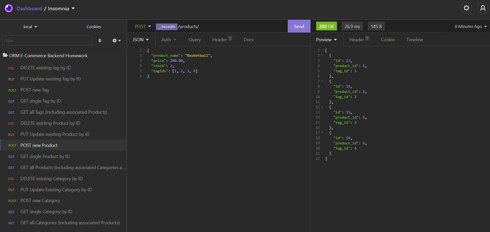

# <Homework Week 13: Object-Relational Mapping (ORM): E-Commerce Back End>  
  
    

  ## Description  
  ### What was your motivation?  
    - AS A manager at an internet retail company, I WANT a back end for my e-commerce website that uses the latest technologies, SO THAT my company can compete with other e-commerce companies  
  ### Why did you build this project?  
    -   To refactor code and integrate better routing and database structuring.
  ### What problem does it solve?  
```md
GIVEN a functional Express.js API
WHEN I add my database name, MySQL username, and MySQL password to an environment variable file
THEN I am able to connect to a database using Sequelize
WHEN I enter schema and seed commands
THEN a development database is created and is seeded with test data
WHEN I enter the command to invoke the application
THEN my server is started and the Sequelize models are synced to the MySQL database
WHEN I open API GET routes in Insomnia Core for categories, products, or tags
THEN the data for each of these routes is displayed in a formatted JSON
WHEN I test API POST, PUT, and DELETE routes in Insomnia Core
THEN I am able to successfully create, update, and delete data in my database
```
  ### What did you learn making this project?  
    - I learned better routing through express, sequelize relationships, and MYSQL database structure.  
   
  ## Table of Contents 
  - [Installation](#installation)  
  - [Usage](#usage)  
  - [Credits](#credits)  
  - [License](#license)  

  ## Installation  
  ### The application will be invoked by using the following command:  
      node server.js  

  ## Usage  
    
  Demo video linked at:[Video](https://drive.google.com/file/d/1Wj-JFtA8zZfABdmZM3cmzu4ut9kMDdlu/view "Demo Video")     
      
  ## Credits  
  Contact me at: [email](poo328@my.utsa.edu "email")  
  Github can be found at: [Github](https://github.com/MrG105 "Github")  
    
  ## License
      Licensed under the MIT license  
  ---